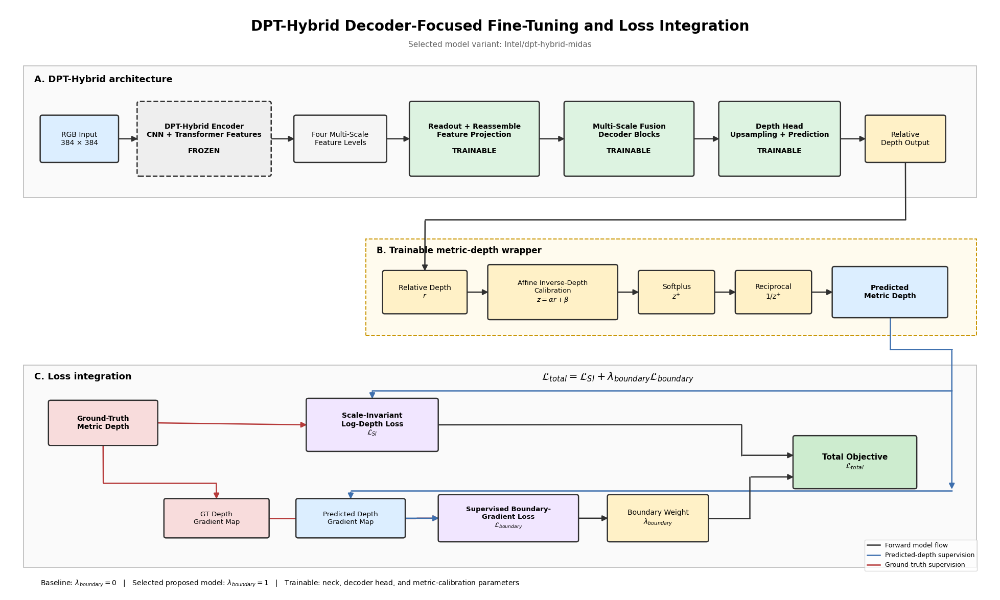

# Monocular Depth Estimation with DPT-Hybrid

**Author:** Kevser Nur Kiraz
**Course:** ECE531 Computer Vision
**Institution:** Abdullah Gül University

## Overview

This repository contains the implementation of an ECE531 term project on monocular depth estimation. The study evaluates a pretrained DPT-Hybrid baseline, introduces decoder-focused fine-tuning with supervised boundary-gradient regularization, and analyzes cross-domain transfer from indoor NYU Depth V2 scenes to outdoor KITTI driving scenes.

Modern reference experiments with ZoeDepth and Depth Anything V2 Small are also included. AdaBins is discussed as an architectural reference for adaptive-bin monocular depth estimation.

## Main Contributions

* Evaluation of the `Intel/dpt-hybrid-midas` baseline on NYU Depth V2.
* Decoder-focused fine-tuning of the neck, decoder head, and metric-depth calibration parameters.
* Comparison of edge-aware smoothness and supervised boundary-gradient losses.
* Ablation studies for boundary-loss-weight selection.
* Independent evaluation on the official NYU Depth V2 validation split.
* Cross-domain evaluation on the KITTI selected-validation split.
* Comparative analysis with `Intel/zoedepth-nyu` and `depth-anything/Depth-Anything-V2-Small-hf`.
* Separate reporting of strict metric-transfer and ground-truth-aligned diagnostic protocols.

## Architecture



## Repository Structure

```text
.
├── 01_monocular_depth_estimation_final.ipynb
├── README.md
├── requirements.txt
├── .gitignore
├── figures/
│   ├── architecture.png
│   ├── nyu_boundary.png
│   ├── boundary_bar.png
│   ├── ablation_composite.png
│   └── kitti_transfer.png
└── results/
    ├── official_nyu_final_comparison.csv
    ├── one_epoch_boundary_weight_refinement.csv
    ├── final_table_a_direct_metric_transfer.csv
    ├── final_table_b_median_scaled_diagnostic.csv
    └── final_table_c_dav2_affine_aligned_diagnostic.csv
```

## Datasets

The experiments use:

1. **NYU Depth V2** for indoor monocular depth experiments.
2. **KITTI Depth Selection** validation images for outdoor cross-domain evaluation.

The datasets are not redistributed in this repository. The notebook contains the required data-preparation steps.

## Models

* `Intel/dpt-hybrid-midas`
* `Intel/zoedepth-nyu`
* `depth-anything/Depth-Anything-V2-Small-hf`

Large pretrained model binaries and experiment checkpoints are intentionally excluded from the repository.

## Environment

The experiments were developed in Google Colab with a GPU runtime.

Install the required packages with:

```bash
pip install -r requirements.txt
```

For a fresh Colab runtime:

1. Open `01_monocular_depth_estimation_final.ipynb`.
2. Run the first installation cell manually.
3. Restart the runtime.
4. Continue from the second cell onward.

## Key Findings

The proposed boundary-regularized DPT-Hybrid model produced small but consistent improvements over the baseline on KITTI, although the differences remained limited.

Strict metric transfer from NYU Depth V2 to KITTI was challenging because indoor metric calibration did not transfer directly to outdoor driving scenes. After diagnostic scale correction, relative scene geometry became substantially more transferable.

Depth Anything V2 Small achieved the strongest relative-depth diagnostic results after reciprocal conversion and per-image alignment. These aligned results use KITTI ground-truth information and must not be interpreted as independent metric-depth predictions.

## Reproducibility Notes

* Dataset archives are not included.
* Large pretrained model binaries and checkpoint files are not included.
* Saved figures and selected final comparison tables are provided.
* Diagnostic median scaling and affine alignment are reported separately from strict direct metric transfer.
* No API token, password, or private credential is included.

## Acknowledgment

AI-assisted tools were used for implementation support, debugging, scientific-writing refinement, and visualization preparation. Experimental execution, result inspection, and final interpretation were reviewed by the author.
